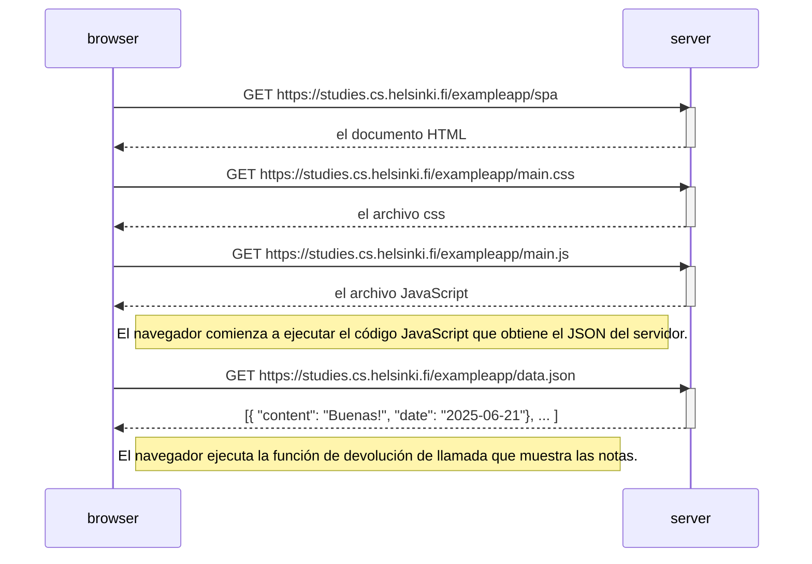

```mermaid
sequenceDiagram
    participant browser
    participant server

    browser->>server: GET https://studies.cs.helsinki.fi/exampleapp/spa
    activate server
    server-->>browser: el documento HTML
    deactivate server

    browser->>server: GET https://studies.cs.helsinki.fi/exampleapp/main.css
    activate server
    server-->>browser: el archivo css
    deactivate server

    browser->>server: GET https://studies.cs.helsinki.fi/exampleapp/main.js
    activate server
    server-->>browser: el archivo JavaScript
    deactivate server

    Note right of browser: El navegador comienza a ejecutar el código JavaScript que obtiene el JSON del servidor.

    browser->>server: GET https://studies.cs.helsinki.fi/exampleapp/data.json
    activate server
    server-->>browser: [{ "content": "Buenas!", "date": "2025-06-21"}, ... ]
    deactivate server

    Note right of browser: El navegador ejecuta la función de devolución de llamada que muestra las notas.
```